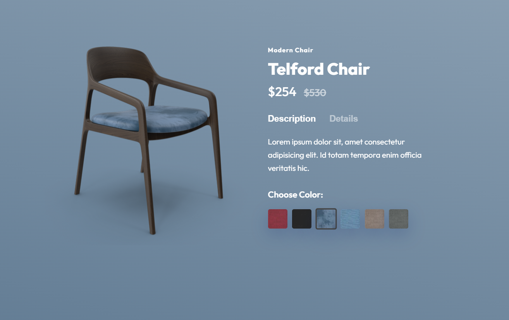

# 🪑 Modern Chair Product Page

A stylish and interactive **product landing page** for a modern chair, built using HTML and CSS.
This project focuses on clean UI design, smooth interactions, and responsive layout.

---

## Features:

* Modern and minimal UI design
* Product details with description & specifications
* Multiple color selection options
* Dynamic chair preview based on selected color
* Add to Cart button UI
* Responsive layout (mobile-friendly)

---

## Tech Stack:

* HTML5
* CSS3

---


## How It Works:

* Uses **radio buttons** to toggle:

  * Product description / details
  * Chair color variations
* CSS is used to dynamically update:

  * Chair image
  * Background color

---

## 📁 Folder Structure:

```
chair-project/
│── index.html  
│── chairs.css  
│── images/  
│── README.md  
```

## What I Learned-

* Creating interactive UI using only HTML & CSS
* Using radio buttons for state management
* Designing clean product pages
* Improving frontend layout skills

---
## Screenshot:



---
## Author:

**Kangan Mane**

* GitHub: https://github.com/kanganmane

---

## ⭐ Support:

If you like this project, give it a ⭐ on GitHub!

